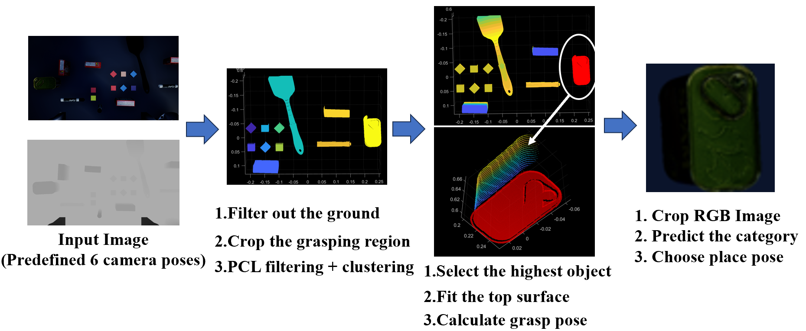
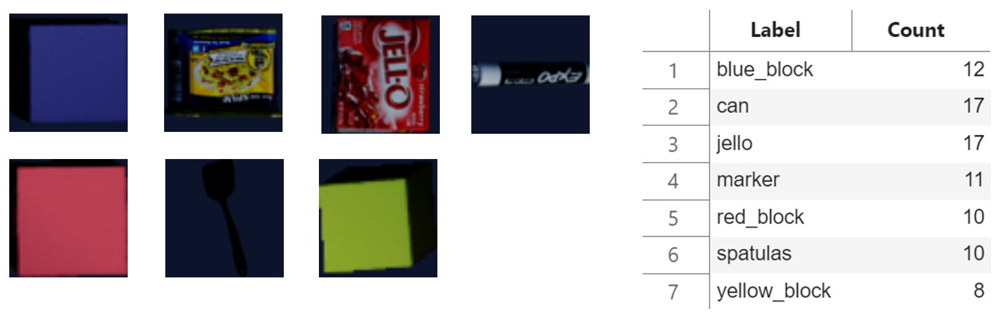

# Solution by Team GL-Simbot

This project was completed by Su Zhian, Wang Yanzhe, Kong Weijie, and Dong Huixu (mentor).

## 📋 Dependencies
The model has the following dependencies. Please ensure you install these as part of MATLAB installation.
* MATLAB 2024b
* Simulink
* MATLAB Support for MinGW-w64 C/C++/Fortran Compiler
* Statistics and Machine Learning Toolbox
* Computer Vision Toolbox
* Robotics System Toolbox
* Simulink 3D Animation

## ▶️ Reproduction
You can watch the video demonstration of our solution [here.](https://drive.google.com/file/d/1sKWptoWUmpazyTpeMssiBQMmT2rPuiRS/view?usp=drive_link)

The development environment is Windows 11. The deep neural network is trained and deployed on a CPU (Intel(R) Core(TM) Ultra 7 155H 3.80 GHz). 

1) Download the official files [here](https://drive.google.com/file/d/1uoVsVzPfLgkspvP9CrgVXUyVXZRZ8R7Q/view) and overwrite the `SimSort_Env_Executable` folder in our projcet.
2) Follow readme_original.md for correct environment setup
3) Open the SimulationSorting.slx file and run.

## 🔍 Method Introduction
Firstly, we use point cloud clustering to segment objects in the scene. The highest object is selected as the target for grasping. Secondly, the top surface of the target object is fitted to determine a top-down grasp pose. Finally, we reproject the target object’s point cloud onto the RGB image for classification.

Algorithm Pipeline

For placement in designated areas, we trained an image classification model by fine-tuning a pre-trained SqueezeNet.
- **Dataset：** 85 images across 7 classes (see Data_and_Utilities/images/classification).
- **Trained Model:** Stored in classification_model.mat.

Image Classification

## 💻 Code Structure
| File | Purpose |
|------|---------|
| `grasp_planning.mlx` | Grasp planner testing & dataset generation |
| `classification.mlx` | CNN training and evaluation |
| `SimulationSorting.slx` | Main implementation |

## 📧 Contact Information
For questions or issues, contact the team at 22425020@zju.edu.cn.