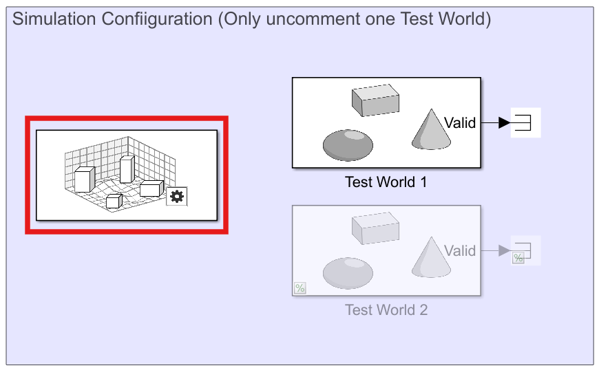
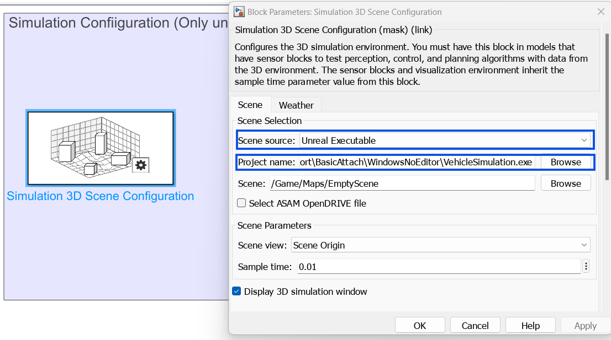

# Simulation Sorting Track - RGMC - ICRA 2025

The contents in this folder provide a couple of environments for the simulation sorting track. The simulink model encloses the environment and some supporting files are provided to load the necessary objects in the simulated world.

## Dependencies

The model has the following dependencies. Please ensure you install these as part of MATLAB installation.
* MATLAB 2024b
* Simulink
* Stateflow
* Computer Vision Toolbox
* Simulink 3D Animation

## Instructions for use
Please follow the listed steps to ensure the model is setup correctly:
1) Download and unzip the package from the link
2) Open the Simulink model
3) Open the Simulation 3D Scene Configuration block present under the Simulation Configuration section as highlighted in the image below. You might get an error message the first time you open the block. Press OK which would open the configuration.

    

4) Ensure Scene Source is set to Unreal Executable
5) Select 'Browse' next to Project Name and browse to the location that has VehicleSimulation.exe. This will be present under the folder 'SimSort_Env_Executable'. This sets the unreal environment. Apply and close the window

    

6) Click on 'Run' in the main model. This should compile the model and run a simulation of the manipulator picking and dropping a marker. Succesful execution of this ensures the model is working as expected. If you run into any issues, please reach out to us.

### Model Overview
The Simulink model by default has three distinct sections.
* Simulation Environment Configuration
* Robot Subsystem
* Planning and Behavior

The Simulation environment contains blocks necessary to setup the simulation world. The Robot Subsytem takes in `joint configuration` and `gripper status`, which are then combined before passing it to the robot block. The binary signal `target attached` returns True when the gripper grabs an object. The other output signals `depth image`, `RGB image`, `camera translation`, `camera rotation` and `joint configuration` can be used in your algorithm.

Note: Please do not change anything in the Simulation Configuration and Robot Subsystem. These build the environment and contain the necessary functions to animate the robot within the environment. There is an option to switch between 2 different environments by uncommenting the specific one that you need. Please ensure only one environment is uncommented. 

You are free to modify the 'Planning and Behavior' section to solve the sorting problem. The environment outputs RGB image and a depth image from the camera mounted on the robot arm. There is an example trajectory provided which moves the robot to pick and drop a marker.

The robot subsystem takes 2 inputs:
* Robot configuration: A 6x1 joint configuration at each timestep. 
* Gripper Status: A binary value that opens or closes the gripper. (0 = OPEN, 1 = CLOSE)

## Submission

Your solution is expected to provide the 2 values (Robot configuration and Gripper status) at each time step. In addition, you can output a stop signal when you have reached the end of the solution. This would stop the simulation which otherwise would run infinitely.

You are allowed to use the full range of MATLAB products to solve this challenge. Should you use another programming language/tool, you are expected to provide all the necessary files for the organizers to run and verify your solution.

For submission, you will be required to provide a public access link to your code and a video of your solution. The submission form can be found [here.](https://forms.office.com/r/XjPbCHib26)

## Prohibited Actions
The following list contains some actions which are prohibited and would result in a dismissal of the solution or a heavy point deduction, at the discretion of the judges.
* Accessing object locations or orientation through the environment parameters.
* Altering the lighting or other environmental parameters
* Changing the location/orientation of the camera attached to the manipulator
* Obtaining segmentation data from the camera attached to the manipulator

Any other actions that does not comply with  the spirit  of the competition, which is developing a realisitc manipulation algorithm, will be subject to a point reduction or a dismissal at the discretion of the judges.

## Contact Information
If you encounter a bug or an unexpected behavior in the environment, please contact the organizers at roboticsarena@mathworks.com with a detailed description and any supporting materials (scripts, videos, screenshots). We would be happy to verify and fix the issue. 

